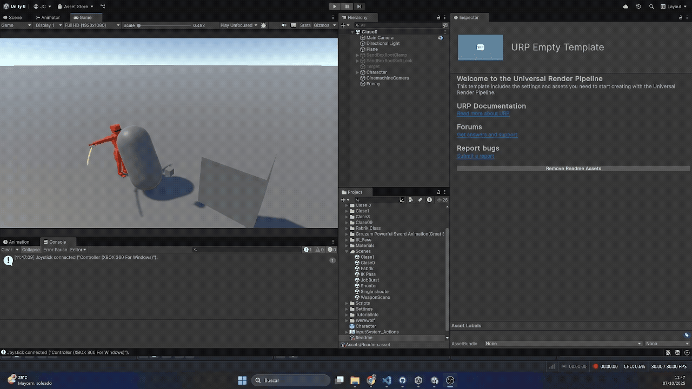

# Entrega3 - Controlador ARPG con combos direccionales

Implementación de un sistema de **combos direccionales** que responde a la orientación del joystick y a secuencias de entrada, respetando ventanas de encadenado y criterios de suavidad.

## Demo

## 

## Objetivo y alcance

**Objetivo.** Construir un sistema de combos direccionales completo donde cada eslabón del combo depende de la dirección actual del stick y de secuencias direccionales, coexistiendo con las ventanas de encadenado.

**Alcance mínimo.**

- Direccionalidad para todos los ataques controlada por joystick
- Encadenado dependiente de ventanas de tiempo
- Respeto por las curvas de desplazamiento en cada eslabón para no “teletransportarse” al salir de ventana
- Deadzone para evitar jitter
- Criterios de diseño claros: deadzone, histéresis, buffers y resolución de conflictos
- Sin regresiones: nada de soft-locks, bucles infinitos o pérdida de control

---

## Controles

### Gamepad

- **Light Attack**: `RB`
- **Heavy Attack**: `RT`
- **Rotación libre**: `Joystick derecho`

### Teclado

- **Orientación direccional para ataques**: `rightStick` (eje X e Y)
- **Light Attack**: (Mouse 0)
- **Heavy Attack**: (Mouse 1)
- **Rotación continua**: `Q` (gira a la izquierda) y `E` (gira a la derecha)

---

## Arquitectura del código

> Nombres de scripts pensados para esta clase. Ajusta si tus archivos difieren.

- **`AttackController.cs`**  
  Orquesta entradas de ataque, ventanas de encadenado y el enrutamiento por dirección actual. Expone callbacks de Input System como `OnLightAttack`, `OnHeavyAttack`, `AttackDirection`, `RotatePlayer`.

- **`ComboLogic`** 
  Representa el eslabón actual del combo, sus salidas y la ventana de encadenado. Mantiene timers de buffer y reglas de prioridad.

- **`DirectionReader`**  
  Normaliza la dirección de `rightStick` o teclado a un **sector** discreto: `Forward`, `Back`, `Left`, `Right`, `Up-Forward`, `Down-Forward`, etc. Aplica deadzone e **histéresis** para evitar “flapping” entre sectores vecinos.

- **`Animator`**  
  Un árbol con capas o submáquinas por **tipo de ataque** y **variantes direccionales**. Cada clip define eventos que abren y cierran ventanas de encadenado.

### Lectura continua del eje de rotación

Ejemplo mínimo para mantener rotación mientras la tecla o stick siga presionado:

```csharp
[SerializeField] Transform character;
[SerializeField] float rotationSpeed = 500f;
[SerializeField] InputActionReference rotateAction; // 1D Axis y rightStick/x

void OnEnable() => rotateAction.action.Enable();
void OnDisable() => rotateAction.action.Disable();

void Update() {
    float input = rotateAction.action.ReadValue<float>(); // -1..1
    if (Mathf.Abs(input) > 0.001f)
        character.Rotate(0f, input * rotationSpeed * Time.deltaTime, 0f, Space.Self);
}
```
